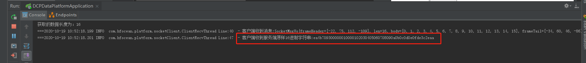

# springboot Demo

 ## 特点
1. springboot整合通用mapper插件、XML以及注解方式，实现查询分页等

2. 自定义日志输出

3. 多配置环境切换，maven打包动态指定配置环境

4. 接口(无论异常)统一格式输出

5. 整合socket客户接收端，用来接收并解析TCP报文 

6. 编写字节转换工具类ByteTransformUtil，便于字节数组转int、字节数组转16进制字符串，便于测试、开发

 ## 说明
 1. 整合的socket客户端，可以通过tcp&udp测试工具相关测试工具进行模拟服务端发送消息，看client是否接收到并输出一样的16进制数据，server发送16进制字节码示例：EA 4B 70 93 00 00 00 10 00 01 02 03 04 05 06 07 08 09 0A 0B 0C 0D 0E 0F DE 3C 2E AA
  

 
 
 ## 搭建步骤
 1. 执行document/db下的sql脚本，建立数据库(支持mysql5.7以上)
 2. 执行test目录下的测试单元
 
 ## 根据不同环境进行打包
例如 测试环境：
mvn clean package -Ptest -Dmaven.test.skip=true
